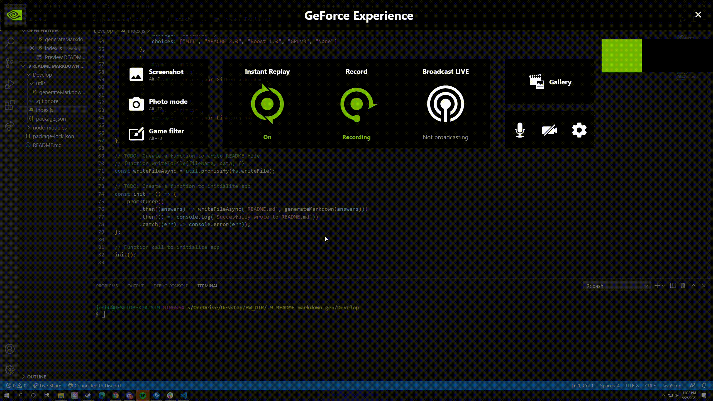

# README Generator

## Description:
    This is a readme generator that automates readme markdown to an extent.

## JS:
    Prompts the user for information for their app and organizes said info in the newly generated README.
    index.js uses inquirer to prompt users with the questions contained in the file
    generateMarkdown.js provides the actual markdown needed to organize the README file.

## Link to Video: 
    https://github.com/Jfig27/README-Generator/blob/main/Develop/src/readme_generator.gif

## Video: 
